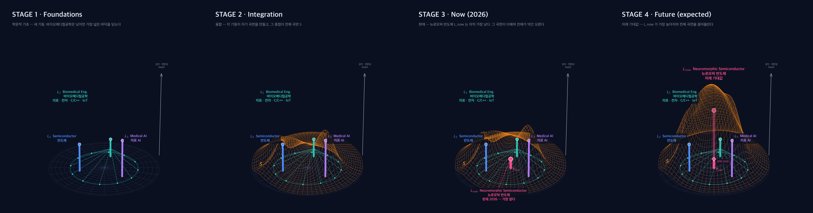
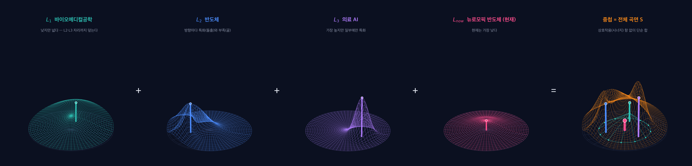

# CV_Portfolio

**Biomedical × Semiconductor × Medical AI → Neuromorphic Semiconductor**

바이오메디컬공학(전공) · 반도체(부전공) · 의료 AI(교육과정) — 세 기초가 뉴로모픽 반도체로
수렴한 과정을 3D 곡면 변형으로 보여주는 포트폴리오. z축은 깊이·전문성(정성적)이다.



각 기둥(학문)이 자기 곡면을 만들고, 전체 곡면은 그 합이다.



| 단계 | 그림 | 의미 |
|---|---|---|
| 1 기초 | 세 기둥 L1 · L2 · L3 (높이 10 · 15 · 20) | 바이오메디컬공학은 낮지만 가장 넓다 — 그 자체로 융합 학문 |
| 2 융합 | 각 기둥의 곡면을 합한 주황 곡면 S | 학문 간 확장 |
| 3 현재 | 중심 기둥 L_now 는 가장 낮다. 그 곡면이 더해져 전체가 약간 오른다 | 2026년, 뉴로모픽 반도체 |
| 4 미래 | L_now 가 가장 높아지며 전체를 끌어올린다 (기대값) | 석사·박사 이후의 목표 |

z축은 깊이·전문성이다. 높이는 경향을 나타내는 상징값이며 정량 척도가 아니다.

- 홈페이지(인터랙티브 3D): https://kimhanbyul2000.github.io/CV_Portfolio/
- 영상: [`assets/video/convergence.mp4`](assets/video/convergence.mp4) (1920×1080, 약 21초)
- 이미지: [`assets/img/`](assets/img/) — `stage1~4.png`, `overview.png`, `decomposition.png`, `hero.png`

## 다시 만들기

```bash
pip install -r requirements.txt
python3 src/render.py --video
python3 -m http.server 8741   # http://localhost:8741/
```

곡면 매개변수는 `data/surface.json`, 홈페이지 본문은 `data/profile.json` 한 곳에서만 고친다.
